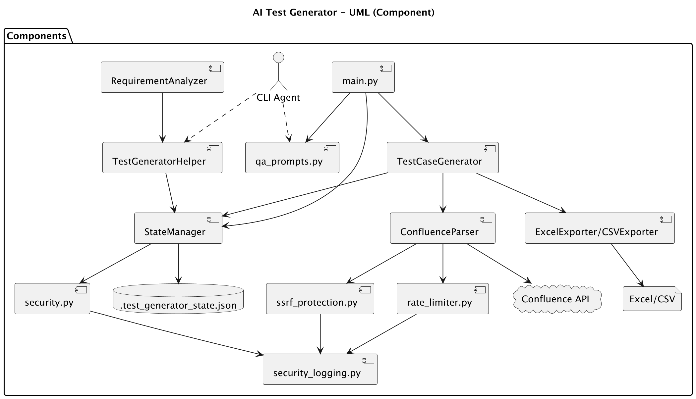

# AI Test Generator

**AI Test Generator** - CLI-first инструмент для работы с требованиями, сохранения состояния и экспорта тест-кейсов. Генерацию тест-кейсов выполняет внешний CLI агент (Claude Code, Qwen Code, Cursor) на основе промптов и контекста из State Manager.

## Диаграмма компонентов



## Возможности

- Загрузка требований из Confluence или текстовых файлов
- Управление состоянием сессии (источник истины для агента)
- Поддержка техник тест-дизайна ISTQB (для использования в промптах агента):
  - Equivalence Partitioning (Эквивалентное разбиение)
  - Boundary Value Analysis (Анализ граничных значений)
  - Decision Table (Таблицы решений)
  - State Transition (Переходы состояний)
  - Use Case Testing (Варианты использования)
  - Pairwise Testing (Попарное тестирование)
  - Error Guessing (Предугадывание ошибок)
- Экспорт результатов в Excel и CSV

## Установка

### 1. Клонирование репозитория

```bash
git clone <repository-url>
cd ai-test-generator
```

### 2. Создание виртуального окружения

```bash
python3 -m venv venv
source venv/bin/activate  # Linux/Mac
# или
venv\Scripts\activate     # Windows
```

### 3. Установка зависимостей

```bash
pip install -r requirements.txt
```

Важно: все команды ниже предполагают активированное виртуальное окружение `venv`.

### 4. Настройка конфигурации (опционально для Confluence)

```bash
cp .env.example .env
```

Отредактируйте `.env`:

```ini
# Confluence Configuration (опционально)
CONFLUENCE_URL=https://your-company.atlassian.net/wiki
CONFLUENCE_USER=your-email@company.com
CONFLUENCE_TOKEN=your-confluence-api-token

# Logging
LOG_LEVEL=INFO
```

## Быстрый старт (демо)

1. Создайте новую сессию:
```bash
python3 main.py state new --agent claude_code
```

2. Загрузите демо-требования:
```bash
python3 main.py load-demo --name petstore
```

3. Получите контекст для агента:
```bash
python3 main.py state context
```

4. Сгенерируйте тесты внешним CLI агентом:
```bash
python3 main.py agent-prompt
# Вставьте промпт и контекст в агента и получите JSON с тест-кейсами
```

5. Экспортируйте результаты:
```bash
python3 main.py state export -f excel -o test_cases
```

Подробное руководство: [AGENT.md](AGENT.md) | [WORKFLOW.md](WORKFLOW.md)

## Загрузка требований

```bash
# Из файла требований
python3 main.py load-file requirements.md

# Из Confluence
python3 main.py load-confluence PAGE_ID

# Демо-требования
python3 main.py load-demo --name petstore
```

### Формат файла требований

Требования должны быть достаточно длинными (50+ символов). Разделяйте их пустой строкой.

Пример `requirements.md`:

```
Система должна разрешать регистрацию пользователя по email и паролю,
валидируя пароль минимум 8 символов.

После успешной регистрации система отправляет письмо с подтверждением
на указанный адрес и помечает аккаунт как неактивный.
```

## Экспорт результатов

```bash
# Экспорт в Excel
python3 main.py state export -f excel -o test_cases

# Экспорт в CSV
python3 main.py state export -f csv -o test_cases

# Экспорт в оба формата
python3 main.py state export -f both -o test_cases
```

## CLI команды

### Основные команды

```bash
# Показать доступные техники тест-дизайна
python3 main.py techniques

# Показать промпт для CLI агента
python3 main.py agent-prompt

# Показать информацию о проекте
python3 main.py info
```

### State Manager

```bash
# Показать состояние
python3 main.py state show
python3 main.py state show -f json

# Создать новую сессию
python3 main.py state new -a claude_code

# Добавить требование
python3 main.py state add "Текст требования"

# Получить контекст
python3 main.py state context

# Что делать дальше
python3 main.py state resume

# Добавить заметку
python3 main.py state note "Важная заметка"

# Экспорт результатов
python3 main.py state export -o tests -f excel

# Очистить состояние
python3 main.py state clear
```

## Структура проекта

```
ai-test-generator/
├── src/
│   ├── agents/          # Модели данных для тест-кейсов
│   ├── generators/      # Загрузка требований и экспорт
│   ├── parsers/         # Парсеры (Confluence)
│   ├── prompts/         # Промпты для генерации тестов
│   ├── state/           # State Manager
│   └── utils/           # Утилиты
├── scripts/             # Вспомогательные скрипты
├── main.py              # CLI интерфейс
├── ARCHITECTURE.md      # Архитектура (ASCII диаграммы)
├── UML.puml             # PlantUML диаграммы
├── SECURITY.md          # Документация по безопасности
├── AGENT.md             # Руководство для CLI агентов
├── WORKFLOW.md          # Пошаговый процесс генерации
├── PROMT.md             # Промпты и инструкции
├── requirements.txt     # Зависимости
└── .env.example         # Пример конфигурации
```

## Документация

| Документ | Описание |
|----------|----------|
| [ARCHITECTURE.md](ARCHITECTURE.md) | Архитектура, диаграммы, паттерны |
| [SECURITY.md](SECURITY.md) | Безопасность, OWASP, аудит |
| [AGENT.md](AGENT.md) | Руководство для CLI агентов |
| [WORKFLOW.md](WORKFLOW.md) | Пошаговый процесс генерации |
| [PROMT.md](PROMT.md) | Промпты и инструкции |

## Требования

- Python 3.10+
- Зависимости из `requirements.txt`

## Development

```bash
# Информация о проекте
python3 main.py info

# Демо генерация (без внешнего агента)
python3 generate_demo_tests.py
```

## Лицензия

MIT

## Контакты

При возникновении вопросов создайте issue в репозитории.
